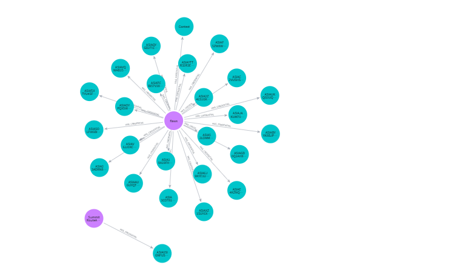
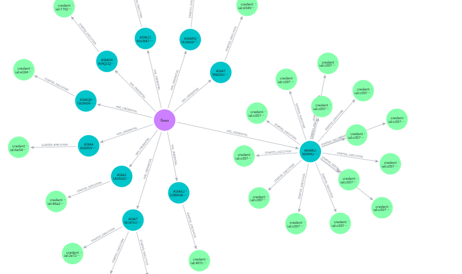
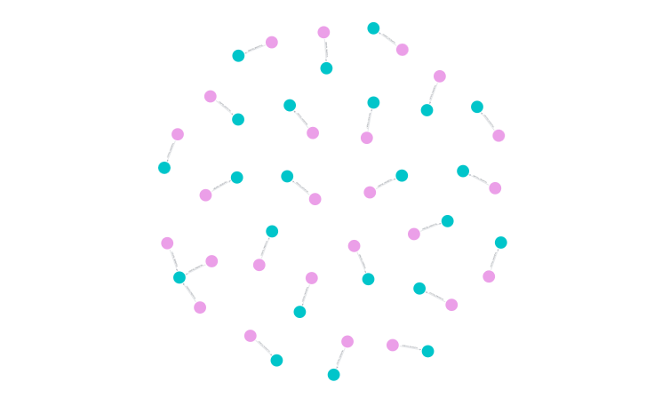
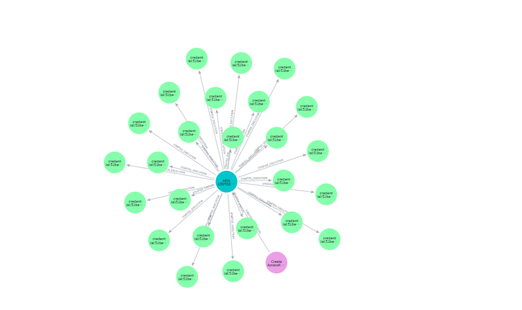
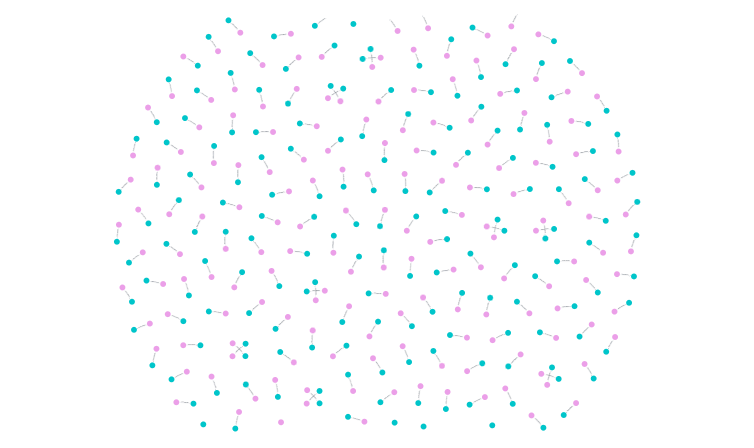

# CloudTrail 그래프 모델링

## 핵심 질문

* CloudTrail 로그의 어떤 정보를 노드로 표현할 것인가?
* 노드 사이의 관계를 어떤 엣지로 표현할 것인가?
* Identity와 Credential을 어떻게 구분할 것인가?
* Credential이 사용되는 실행 문맥을 어떻게 표현할 것인가?
* 새로운 Credential이 생성되는 과정을 어떻게 그래프로 연결할 것인가?
* 자격 증명을 중심으로 이후 행위 흐름을 어떻게 확인할 것인가?

<br>

## 진행 내용

### 1. 노드 정의

CloudTrail 로그에서 확인할 수 있는 정보를 기준으로 다음과 같이 노드를 구성했습니다.

| 노드           | 설명                        | 주요 속성                                                            |
| ------------ | ------------------------- | ---------------------------------------------------------------- |
| `Identity`   | AWS API 호출 주체             | `identityType`, `accountId`, `principalId`, `arn`, `name`        |
| `Credential` | API 호출에 사용된 자격 증명         | `accessKeyId`, `credentialType`, `identityId`                    |
| `Execution`  | Credential이 사용된 실행 문맥     | `sourceIP`, `userAgent`, `firstSeen`, `lastSeen`, `eventCount`   |
| `APIEvent`   | CloudTrail에 기록된 개별 API 호출 | `eventName`, `eventSource`, `eventTime`, `awsRegion`, `sourceIP` |
| `Resource`   | API 호출 대상 AWS 리소스         | `resourceType`, `resourceName`, `arn`, `accountId`, `region`     |

각 노드는 고유한 `id` 값을 기준으로 식별하도록 구성했습니다.

<br>

### 2. 데이터 구성

CloudTrail 원본 로그에서 그래프 구성에 필요한 정보를 추출하여 다음 CSV 파일로 분리했습니다.

```text
identity.csv
credential.csv
execution.csv
api_event.csv
resource.csv
edges.csv
```

각 노드에 해당하는 정보는 별도의 CSV 파일에 저장하고, 노드 사이의 관계는 `edges.csv`에 저장했습니다.

`edges.csv`는 다음과 같은 구조를 사용합니다.

```text
source_id,relationship_type,target_id
```

이를 통해 각 노드의 고유 ID를 기준으로 관계를 연결할 수 있도록 구성했습니다.

<br>

### 3. 주요 그래프 관계

현재 모델에서는 Identity, Credential, Execution을 분리하여 주체와 자격 증명, 실제 실행 문맥을 각각 표현합니다.

Identity와 Credential을 분리함으로써 동일한 Identity가 여러 Credential을 사용하는 상황을 표현할 수 있도록 했습니다.

또한 Credential과 Execution을 분리하여 자격 증명 자체와 해당 자격 증명이 실제로 사용된 실행 문맥을 구분했습니다.

<br>

### 4. Credential 생성 관계

CloudTrail API 이벤트 중 새로운 자격 증명이 생성되는 경우 다음과 같은 관계를 구성했습니다.

```text
APIEvent
   |
   | CREATED_CREDENTIAL
   |
   Y
Credential
```

`CREATED_CREDENTIAL` 관계를 통해 특정 API 호출로부터 새로운 Credential이 생성된 사실을 그래프에 표현합니다.

이를 통해 개별 API 이벤트만 보는 것이 아니라, 자격 증명이 새롭게 생성되는 전환 지점을 그래프 상에서 확인할 수 있도록 했습니다.

<br>

### 5. Neo4j 적용

가공된 CSV 데이터를 Neo4j에 적재하여 노드와 관계를 시각화했습니다.

Neo4j 관련 파일은 다음과 같이 관리합니다.

```text
neo4j/
├─ import.cypher
└─ queries/
   ├─ identity-credential.cypher
   ├─ identity-credential-execution.cypher
   ├─ created-credential.cypher
   ├─ credential-chain.cypher
   └─ credential-overview.cypher
```

`import.cypher`는 CSV 데이터를 Neo4j 노드와 관계로 적재하기 위해 사용합니다.

`queries/` 디렉터리의 Cypher 파일은 생성된 그래프를 조회하고 시각화하기 위해 사용합니다.

<br>

## 시각화 결과

### 1. Identity와 Credential 관계

하나의 Identity를 중심으로 여러 Credential이 연결되는 구조를 확인했습니다.



* `flaws` Identity를 중심으로 여러 Access Key 및 Credential이 연결되는 형태를 확인할 수 있습니다.
* 동일한 Identity에서 여러 자격 증명이 사용되는 구조를 그래프로 표현할 수 있음을 확인했습니다.

<br>

### 2. Identity와 Credential 기반 실행 구조

Identity에서 여러 Credential이 연결되고, 각 Credential을 기준으로 추가 실행 관련 노드가 이어지는 구조를 확인했습니다.



* 하나의 Identity에서 여러 Credential로 관계가 분기되는 형태를 확인할 수 있습니다.
* 각 Credential을 기준으로 이후 실행 문맥이 연결되는 구조를 확인할 수 있습니다.
* Credential이 실제로 사용되는 실행 단위까지 확장하여 표현할 수 있음을 확인했습니다.

<br>

### 3. 새로운 Credential 생성

APIEvent와 새롭게 생성된 Credential 사이의 `CREATED_CREDENTIAL` 관계를 확인했습니다.



* 각 APIEvent 노드와 Credential 노드가 `CREATED_CREDENTIAL` 관계로 연결되는 형태입니다.
* CloudTrail API 이벤트 중 새로운 자격 증명을 생성한 이벤트와 생성 결과를 직접 연결할 수 있습니다.

<br>

### 4. Credential 중심 연결 구조

특정 Credential을 중심으로 여러 관련 노드가 연결되는 구조를 확인했습니다.



* 특정 Credential을 기준으로 여러 실행 및 관련 노드가 연결되는 형태를 확인할 수 있습니다.
* 개별 이벤트 단위로 로그를 확인하는 대신 특정 자격 증명을 중심으로 관련 행위가 어떻게 확장되는지 확인할 수 있습니다.

<br>

### 5. Credential 생성 관계 분포

`CREATED_CREDENTIAL` 관계를 넓은 범위로 조회하여 데이터 전체에 존재하는 자격 증명 생성 관계의 분포를 확인했습니다.




* 여러 APIEvent와 Credential 사이의 `CsREATED_CREDENTIAL` 관계가 반복적으로 존재하는 것을 확인할 수 있습니다.
* 개별 공격 경로보다는 전체 데이터에서 자격 증명 생성 관계가 어느 정도 존재하는지 확인하기 위한 보조 시각화입니다.

<br>

## 결과

* CloudTrail 로그를 `Identity`, `Credential`, `Execution`, `APIEvent`, `Resource` 노드로 분리하여 그래프 모델을 구성했습니다.
* Identity와 Credential을 별도 노드로 표현하여 하나의 주체가 여러 자격 증명을 사용하는 상황을 표현할 수 있도록 했습니다.
* Credential과 Execution을 구분하여 자격 증명 자체와 해당 자격 증명이 사용된 실행 문맥을 별도로 표현했습니다.
* CloudTrail의 개별 API 호출을 `APIEvent` 노드로 구성하여 이벤트 자체를 그래프 분석 대상으로 포함했습니다.
* `CREATED_CREDENTIAL` 관계를 통해 API 이벤트로부터 새로운 Credential이 생성되는 관계를 표현했습니다.
* 실제 flaws.cloud 데이터를 Neo4j에 적재하여 Identity, Credential, Execution 및 Credential 생성 관계가 그래프로 표현되는 것을 확인했습니다.
* 특정 Identity 또는 Credential을 중심으로 관련 자격 증명과 실행 흐름을 확장하여 확인할 수 있음을 확인했습니다.

<br>

## 향후 진행

* `Execution → APIEvent` 관계를 명확하게 연결하여 실행 단위에서 발생한 CloudTrail 이벤트를 표현
* `APIEvent → Resource` 관계를 추가하여 실제 접근 대상 리소스까지 연결
* 새로운 Credential 생성 이후 해당 Credential이 다시 Execution과 APIEvent로 이어지는 전체 경로 구성
* 여러 Credential 전환이 연속적으로 발생하는 경우 하나의 공격 경로로 연결하는 방식 검토
* 대규모 그래프에서 조사에 필요한 핵심 경로만 선별하는 방식 검토
* 다른 그래프 모델링 결과와 비교하여 공통 노드, 관계 및 속성 구조 결정
