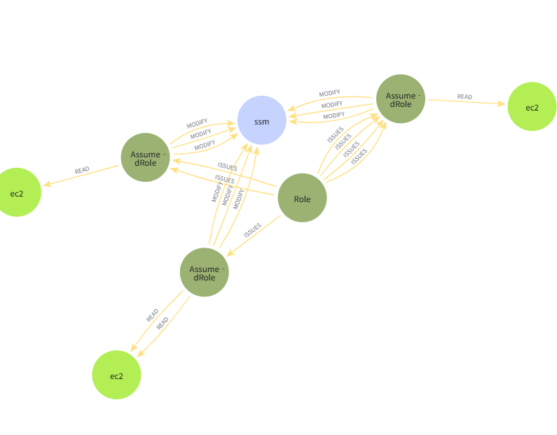
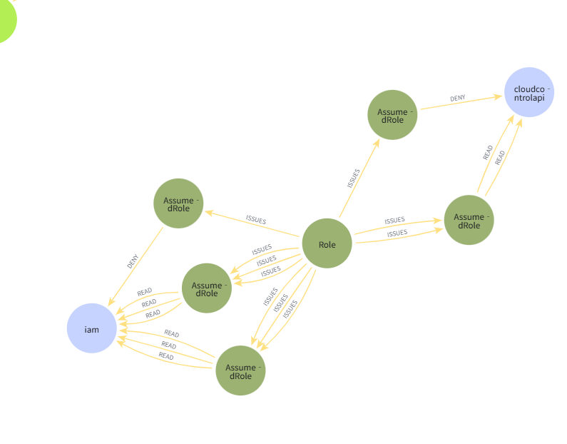

# AWS Lateral Movement (EC2 Instance Connect) 공격 시뮬레이션 및 그래프 기반 분석 보고서

## 1. 개요 (Overview)

본 보고서는 **Stratus Red Team**을 활용하여 AWS 환경에서 수행한 `ec2-instance-connect` 기반 횡적 이동(Lateral Movement) 공격 시뮬레이션 과정 및 결과를 정리한 문서입니다. 

시뮬레이션 수행 중 수집된 `aws.lateral-movement.ec2-instance-connect.json` CloudTrail 로그 데이터를 그래프 데이터베이스(Neo4j)로 구조화하고, Cypher 쿼리를 통해 공격자의 식별 가능한 킬 체인(Kill Chain) 및 권한 남용 경로를 시각적으로 검증하였습니다.

---

## 2. 테스트 환경 및 대상 로그

* **공격 시나리오**: Stratus Red Team - `aws.lateral-movement.ec2-instance-connect`
* **사용 로그 파일**: `aws.lateral-movement.ec2-instance-connect.json`
* **주요 자산 및 식별자**:
  * **AWS 계정 ID**: `949328302905`
  * **수행 IAM User**: `Huge-log-attack-simulation`
  * **수행 IP**: `165.132.5.130`
  * **지역 (Region)**: `ap-northeast-2`
  * **생성된 주요 역할/인스턴스 프로파일**:
    * `stratus-red-team-ec2-sshpublickey-lateral-movement-role`
    * `stratus-red-team-ec2-sshpublickey-lateral-movement-instance`
  * **생성된 주요 인프라**: VPC (`vpc-0b58d9b60703dc96c`), EC2 Instance (`i-0964af316137d703b`, `i-04ee74779fa532da1`)

---

## 3. 테스트 진행 절차 (Test Execution Process)

### Step 1: Stratus Red Team 공격 시뮬레이션 수행
1. `Huge-log-attack-simulation` IAM 사용자 자격 증명 및 Terraform/Stratus Red Team 도구를 통해 시나리오 실행.
2. IAM Role 생성 및 `AmazonSSMManagedInstanceCore` 정책 매핑.
3. EC2 및 네트워크 인프라(VPC, Subnet, IGW, NAT Gateway, ENI) 배포.
4. EC2 Instance Connect / SSM을 통한 SSH Public Key 주입 및 횡적 이동 시도.

### Step 2: CloudTrail 로그 수집 및 Graph DB (Neo4j) 수집/인제스트
1. 발생한 이벤트 로그(`aws.lateral-movement.ec2-instance-connect.json`) 수집.
2. IAM 행위 주체(`Actor`), 발급된 세션(`AssumedRole`), 타겟 서비스 및 자원(`IAM`, `SSM`, `EC2`, `CloudControlAPI`) 간의 관계를 노드(Node) 및 엣지(Edge)로 매핑.

### Step 3: Cypher 쿼리를 통한 행위 탐색 및 시각화
공격자의 행위 체인(Actor $
ightarrow$ Role Session $
ightarrow$ Target Resource)을 추적하기 위해 아래 Cypher 쿼리를 실행함.

```cypher
MATCH path = (issuer:Actor)-[r1:ISSUES|ASSUME_ROLE]->(assumed:Actor)-[r2:ACCESS]->(target)
RETURN path
LIMIT 50;
```

---

## 4. 분석 결과 및 공격 식별 (Analysis & Findings)

### 4.1. 결과 그래프 시각화 (Visualization)

#### 결과 1: IAM 권한 탐색 (Reconnaissance) 및 CloudControlAPI 제어 시도


* **분석 내용**:
  * Central Node인 `Role`에서 복수의 `AssumedRole` 세션이 지속해서 발급(`ISSUES`)됨.
  * 발급된 세션이 `iam` 및 `cloudcontrolapi`에 대해 탐색성 `READ` 요청 및 권한 부족으로 인한 `DENY` 이벤트를 유발함.
  * 이는 침투 초기 단계에서 획득한 Role의 권한 범위를 확인하기 위한 **권한 탐색(Reconnaissance)** 행위로 식별됨.

---

#### 결과 2: SSM 조작 및 EC2 횡적 이동 (Lateral Movement) 경로


* **분석 내용**:
  * Central `Role`에서 생성된 세션이 `ssm` 서비스에 대해 다수의 `MODIFY` 요청을 수행함.
  * 이후 `ec2` 자원으로 연쇄적인 `READ` 및 접근 행위가 연결됨.
  * 이는 SSM(Systems Manager) 및 EC2 Instance Connect를 활용하여 EC2 인스턴스 내부로 명령을 전달하거나 Public Key를 주입하여 **횡적 이동(Lateral Movement)**을 완결 짓는 전형적인 공격 킬 체인 흐름을 명확히 보여줌.

---

## 5. 결론 및 시사점 (Conclusion)

1. **공격 식별 가능성**:
   * 단일 CloudTrail 로그 단위 검토 시 단순 인프라 구축 작업으로 위장될 수 있으나, **Graph DB 기반 시각화**를 수행함으로써 **"IAM Role 생성/인계 $
ightarrow$ 권한 탐색(DENY 발생) $
ightarrow$ SSM 설정 변경(MODIFY) $
ightarrow$ EC2 접근"**으로 이어지는 공격 체인을 명확히 식별할 수 있음.
2. **보안 대응 방안**:
   * 단시간 내 발생하는 다수의 Role Assumption 및 `DENY` 탐색 행위 모니터링 강화.
   * `ec2-instance-connect:SendSSHPublicKey` 및 SSM 관련 `MODIFY` API 호출에 대한 실시간 알림 및 제어 정책 적용 필요.
